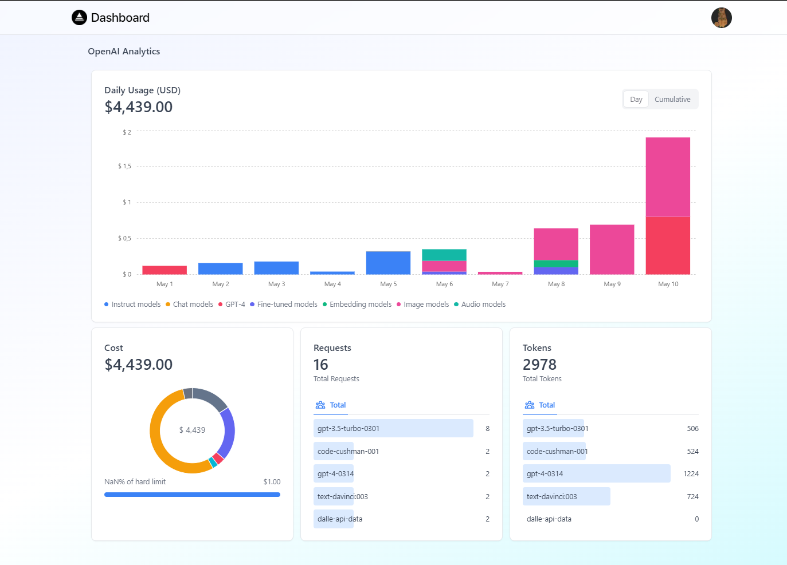
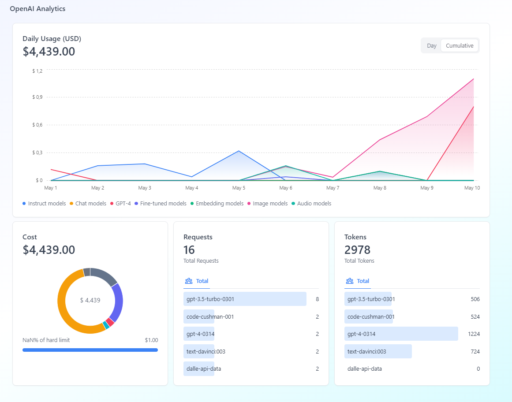

# OpenAI-Dashboard
openAI-dashboard is an open-source Dashboard that allows the user to visualize in a clear and intuitive way how OpenAI models are being used.





## 🚀 Quickstart

### 1. Clone the repository and install dependencies

```bash
git clone https://github.com/Rayjay-8/openAI-dashboard.git
cd openAI-dashboard
npm install
```

### 2. Configure your local environment
Copy the .env.local.example file in this directory to .env.local (which will be ignored by Git):

| Variable | Description |
| -------- | ----------- |
| **`OPENAI_API_KEY`** | OpenAI API Key. |
| **`OPENAI_BEARER_TOKEN`** | To get user info, not mandatory. |

### 3. Run
```bash
 npm run dev
```

Open [http://localhost:3000](http://localhost:3000) with your browser to see the result.

## how does it work
Routes:

- user info
https://api.openai.com/dashboard/onboarding/login

- graph data
https://api.openai.com/dashboard/billing/usage?end_date=2023-06-01&start_date=2023-05-01

- soft and hard limit
https://api.openai.com/dashboard/billing/subscription

- get request number, tokens and context 
https://api.openai.com/v1/usage?date=2023-05-08

## Community & Support

* [GitHub issues](https://github.com/Rayjay-8/openAI-dashboard/issues/new) - to report bugs

## Learn More

To learn more about Next.js, take a look at the following resources:

- [Next.js Documentation](https://nextjs.org/docs) - learn about Next.js features and API.
- [Learn Next.js](https://nextjs.org/learn) - an interactive Next.js tutorial.